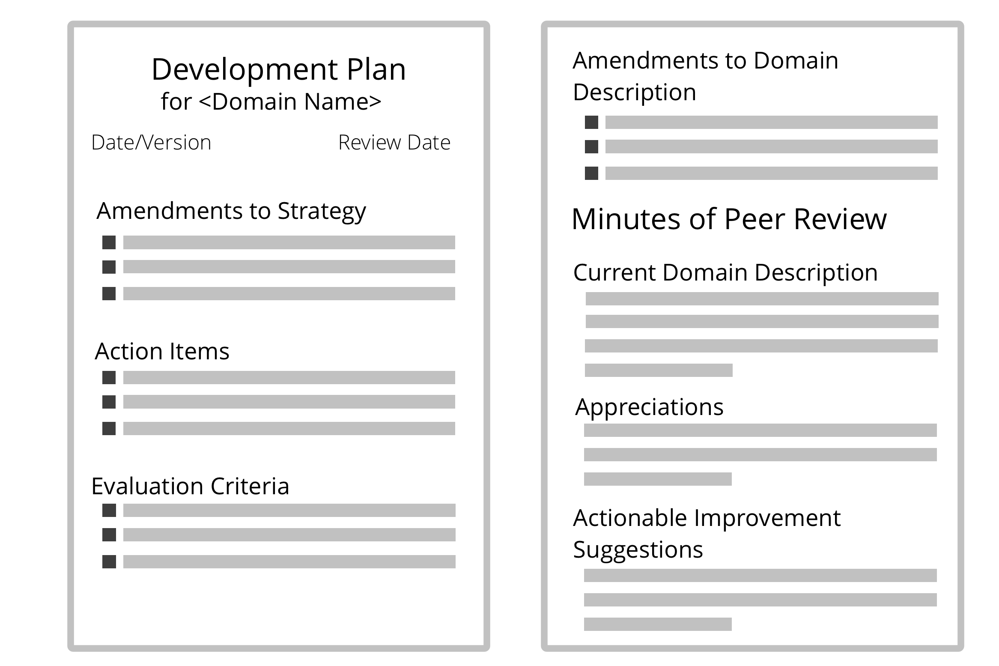

**A plan for how to develop more effective ways of accounting for a domain, agreed between delegator and delegatee.**

The development plan may be created for a person in a role, or for a team (e.g. a department, [circle](circle.html) or [open domain](open-domain.html)).

Development may happen in the form of refining the description of the [driver](organizational-driver.html) and the <dfn data-info="Domain: A distinct area of influence, activity and decision making within an organization.">domain</dfn>, making amendments to <dfn data-info="Strategy: A high level approach for how people will create value to successfully account for a domain.">strategy</dfn>, or new or updated agreements and specific actions to be taken, either within the domain of the delegator, or the domain of the delegatee.

A development plan (and any accompanying recommendations for changes to the  descriptions of the <dfn data-info="Domain: A distinct area of influence, activity and decision making within an organization.">domain</dfn> and the <dfn data-info="Organizational Driver: A driver is a person’s or a group&apos;s motive for responding to a specific situation. A driver is considered an **organizational driver** if responding to it would help the organization generate value, eliminate waste or avoid harm.">driver</dfn>) requires consent from both the <dfn data-info="Delegatee: An individual or group accepting accountability for a domain delegated to them.">delegatee</dfn> and the <dfn data-info="Delegator: An individual or group delegating a domain to other(s) to be accountable for.">delegator</dfn>.

[&#9654; Enablers Of Collaboration](enablers-of-collaboration.html) [&#9664; Peer Review](peer-review.html) [&#9650; Peer Development](peer-development.html)

