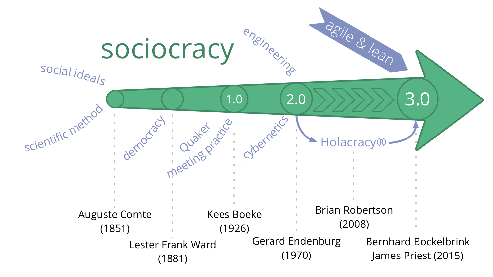
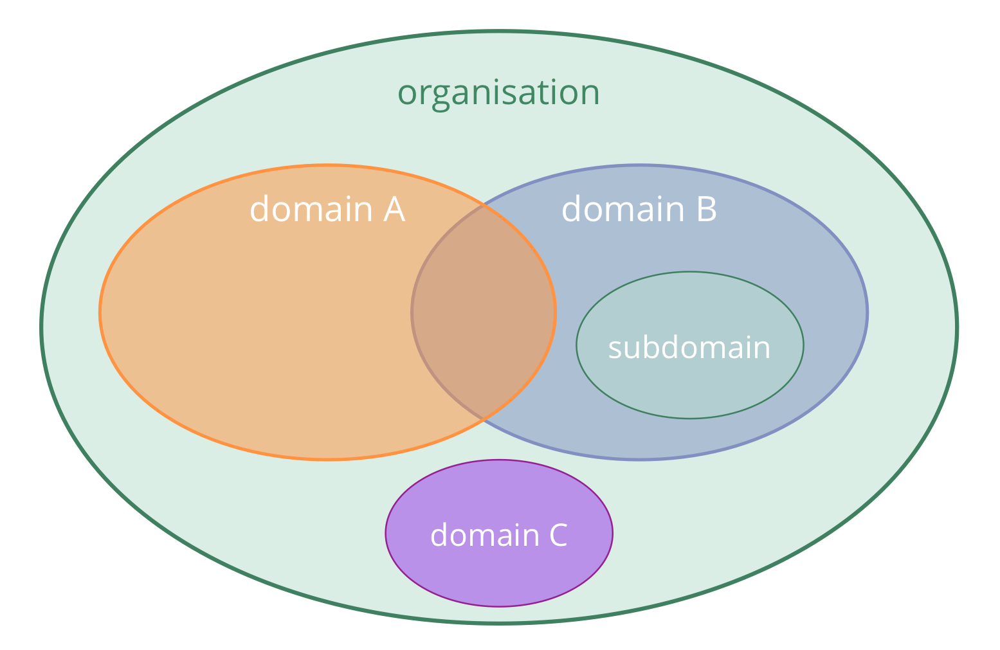

## Sociocracy 3.0 - A Practical Guide For Evolving Agile and Resilient Organizations 

### Effective Collaboration At Any Scale

-   **principles-based**: a coherent way for growing organizational integrity and developing a sociocractic and agile mindset
-   **flexible**: adaptable patterns, independent and mutually reinforcing, to help you with all aspects of collaboration
-   **free**: licensed under a Creative Commons Free Culture License

## What's in it for me?

Sociocracy 3.0 — **a.k.a. "S3"** — brings you an extensive collection of guidelines and practices (patterns) that have proven helpful for organizations to **improve performance, alignment, fulfillment and wellbeing**. 

S3 helps you discover how to best reach your objectives and navigate complexity, one step at a time, **without the need for sudden radical reorganization or planning a long-term change initiative**:

-   Simply start with your area of greatest need, select one or more patterns to try, **move at your own pace** and develop skills as you go. 

-   **Regardless of your position in the organization**, you will find patterns that are relevant and helpful for you.

## Contents

-   a brief overview of some basic concepts behind S3
-   a description of all the patterns in S3
-   an appendix 
    -   changelog
    -   info about authors and acknowledgments
    -   the license
    -   glossary and index

## Influences and History

## Driver for Creating Sociocracy 3.0

> _In 2014 we came together to co-create a body of Creative Commons licensed learning resources, synthesizing ideas from Sociocracy, Agile and Lean. We discovered that organizations of all sizes need a flexible menu of practices and structures – appropriate for their specific context – that enable the evolution of a sociocratic and agile mindset to achieve greater effectiveness, alignment, fulfillment and wellbeing._

## Basic Concepts

Before diving into the content, consider taking time to learn about some basic concepts behind S3: 

- what is a pattern?
- the seven principles
- drivers, value and waste
- domains, delegation and accountability
- governance, self-organization and semi-autonomy

For any terms you don't understand check out the glossary at the end.

## Patterns 

_A **pattern** is a template for successfully navigating a specific context._

-   S3 patterns are discovered through observing many organizations as they solve problems and respond to opportunities
-   S3 patterns can be evolved and adapted to suit differing contexts
-   the patterns are grouped by topic into ten categories

## All Patterns are based on The Seven Principles

## The Seven Principles

**The Principle of Effectiveness:** *Devote time only to what brings you closer toward achieving your objectives.*

**The Principle of Consent:** *Raise, seek out and resolve objections to decisions and actions.*

**The Principle of Empiricism:** *Test all assumptions through experimentation and continuous revision.*

**The Principle of Continuous Improvement:** *Change incrementally to accommodate steady empirical learning.*

**The Principle of Equivalence:** *Involve people in making and evolving decisions that affect them.*

**The Principle of Transparency:** *Make all information accessible to everyone in an organization, unless there is a reason for confidentiality.*

**The Principle of Accountability:** *Respond when something is needed, do what you agreed to do, and take ownership for the course of the organization.*

## The Principle of Accountability

*Respond when something is needed, do what you agreed to do, and take ownership for the course of the organization.*

Act within the constraints of any agreements governing domains you are accountable for, including the organization itself, groups you are part of, and roles you keep.

Everyone's primary accountability is for effective collaboration in response to organizational drivers.

Individuals are also accountable for their work, ongoing learning and development, and for supporting one another.

Everyone in an organization is accountable for aligning action with organizational values.
 
## Drivers

_A **driver** is a person’s or a group's motive for responding to a specific situation._

Drivers: 

-   can be used to derive goals, objectives, aims, mission, vision, purpose
-   can change over time

### Drivers: Value and Waste

_**Value** is the importance, worth or usefulness of something in relation to a driver._

_**Waste** is anything unnecessary for — or standing in the way of — a (more) effective response of a driver._

By adopting the concept of value and waste, many practices and ideas from **lean production** and **lean software development** can be utilized by organizations pulling in S3 patterns:

-   value stream mapping
-   various strategies for eliminating waste
-   the Kanban Method

## Domains

_A **domain** is a distinct area of influence, activity and decision making within an organization._

All domains are within the overall domain of an organization and may overlap and/or be fully contained within other domains.

Domains are delegated to people (e.g. to a unit, department, team or individuals), who take responsibility for the domain, and act within its defined constraints on influence and autonomy.

## Delegating Domains

Those delegating a domain (the _delegators_) still retain overall accountability for that domain, and often define:

-   **key responsibilities** (any essential work and decision making being delegated)
-   **constraints to the autonomy and influence** of those the domain is delegated to (the _delegatees_), usually related to the organization itself (e.g. budget, resources, level of delegation, reporting)

## Drivers and Domains

It's also possible to understand a domain in relation to organizational drivers:

-   the domain's **primary driver** - the main driver the people accounting for that domain (the _delegatees_) respond to
-   the set of subdrivers the organization may benefit from addressing when responding to the primary driver, which include:
    -   **key responsibilities** (any driver following directly from the domain's primary driver)
    -   drivers for **constraints of the domain** (which typically relate to the organization's wider context)

## Governance, Semi-Autonomy and  Self-Organization

**Governance**: Making and evolving decisions about what to do to achieve objectives, and setting constraints on how and when things will be done.

**Self-Governance**: People governing themselves within the constraints of a domain.

**Self-Organization**: People organizing work within constraints defined through governance.

**Operations** (Doing the Work): The work being done to create and deliver value, guided by governance.

**Semi-Autonomy**: The autonomy of people to create value, limited by the constraints of their domain (including the influence of the delegator and of representatives), and by objections from others.

## Governance or Operations?

_Does it require or benefit from an individual or group decision?_

-   yes: governance
    -   it's not covered by a previous agreement
    -   it needs to be agreed, decided or amended
-   no: operations
    -   it's covered by previous agreement (those accountable are free to act)
    -   it needs to be done

[&#9654; Co-Creation And Evolution](co-creation-and-evolution.html)

