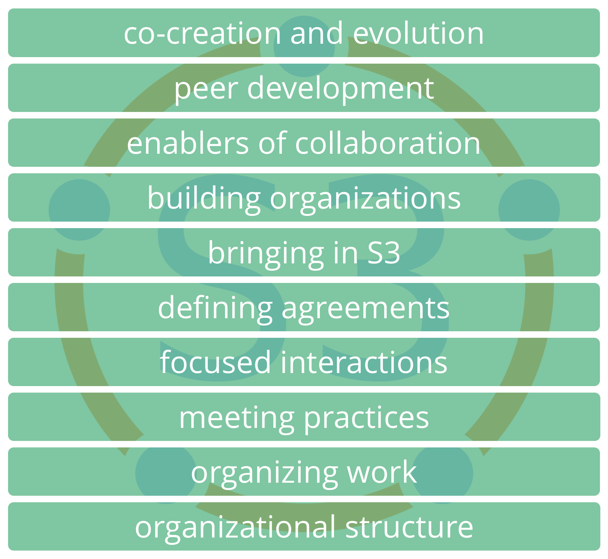
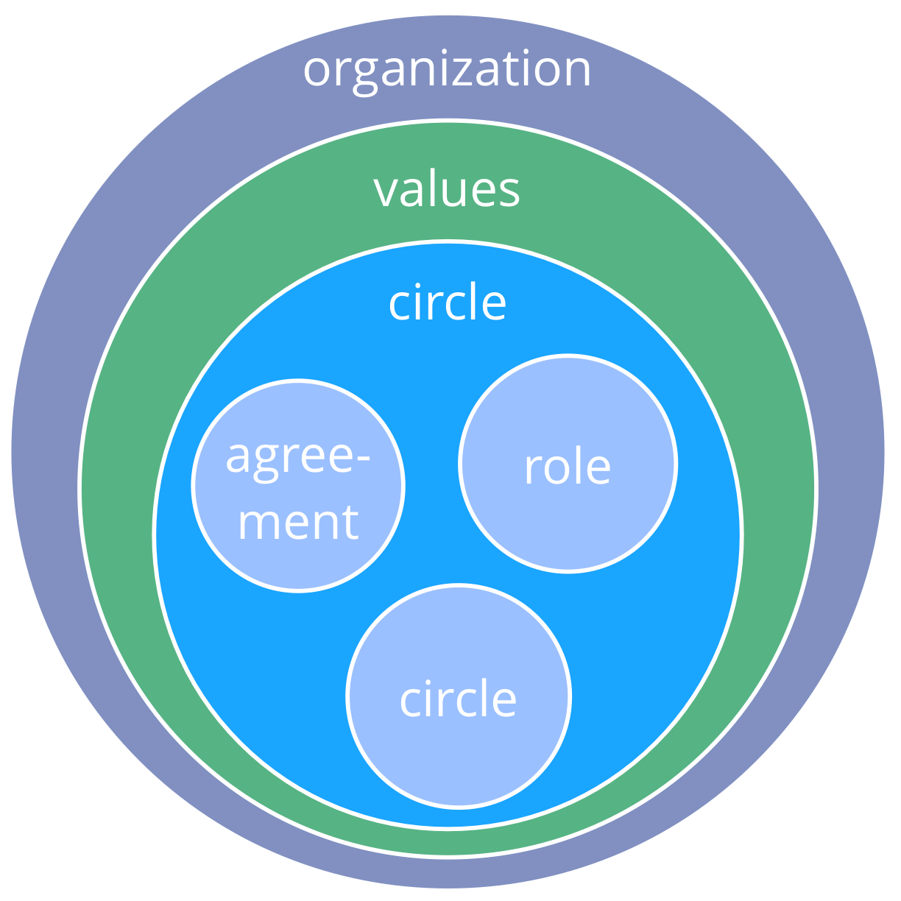

# Sociocracy 3.0 - A Practical Guide For Evolving Agile and Resilient Organizations 

### Effective Collaboration At Any Scale

-   **principles-based**: A coherent way for growing organizational integrity and developing a sociocractic and agile mindset
-   **flexible**: adaptable patterns, independent and mutually reinforcing, to help you with all aspects of collaboration
-   **free**: licensed under a Creative Commons Free Culture License

## What's in it for me?

Sociocracy 3.0 - **a.k.a. "S3"** - brings you an extensive collection of guidelines and practices (patterns)  that have proven helpful for organizations for **improving performance, alignment, fulfillment and wellbeing**. 

S3 helps you discover how to best reach your objectives and navigate complexity, one step at a time, **without the need for radical reorganization or a big change initiative**:

-   Simply start with your area of greatest need, select one or more patterns to try, **move at your own pace** and develop skills as you go. 

-   **Regardless of your position in the organization**, you will find patterns that are relevant and helpful for you.

## Contents

-   a brief overview of some basic concepts behind S3
-   a description of all the patterns in S3
-   an appendix with a changelog, acknowledgments, info about authors and license, a glossary and an index

## Influences and History

## Basic Concepts

Before diving into the content, consider taking time to learn about some basic concepts behind S3: 

- what is a pattern?
- the seven principles
- drivers, value and waste
- domains, delegation and accountability
- governance, self-organization, and semi-autonomy

For any terms you don't understand check out the glossary at the end.

## Patterns 

_A **pattern** is a template for successfully navigating a specific context._

-   S3 patterns are discovered through observing many organizations as they solve problems and respond to opportunities
-   S3 patterns can be evolved and adapted to suit differing contexts
-   the patterns are grouped by topic into ten categories

## All Patterns are based on The Seven Principles

## The Seven Principles

**Effectiveness:** *Devote time only to what brings you closer towards achieving your objectives.*

**Consent:** *Do things in the absence of reasons not to.*

**Empiricism:** *Test all assumptions through experiments, continuous revision and falsification.*

**Continuous Improvement:** *Change incrementally to accommodate steady empirical learning.*

**Equivalence:** *Involve people in making and evolving decisions that affect them.*

**Transparency:** *Make all information accessible to everyone in an organization, unless there is a reason for confidentiality.*

**Accountability:** *Respond when something is needed, do what you agreed to and take ownership for the course of the organization.*

## Drivers

_A **driver** is a person’s or a group's motive for responding to a specific situation._

Drivers: 

-   can be used to derive goals, objectives, aims, mission, vision, purpose
-   can change over time

### Drivers: Value and Waste

_**Value** is the importance, worth or usefulness of something in relation to a driver._

_**Waste** is anything not necessary for - or standing in the way of - effective response of a driver._

By adopting the concept of value and waste, many practices and ideas from **lean production** and **lean software development** can be utilized by organizations pulling in S3 patterns:

-   value stream mapping
-   various strategies for eliminating waste
-   the Kanban Method

## Domains

_A **domain** is a distinct area of influence, activity and decision making within an organization._

All domains are within the overall domain of an organization and may overlap and/or be fully contained within other domains.

Domains are delegated to people (e.g. to a unit, department, team or individuals), who take accountability for the domain, within its defined constraints on influence and autonomy.

## Delegating Domains

Those delegating a domain (the _delegators_) still retain overall accountability for that domain, and often define:

-   **key responsibilities** (essential work and decision making being delegated)
-   **constraints to autonomy and influence** for those the domain is delegated to, usually related to the organization itself (e.g. budget, resources, level of delegation, reporting)

## Drivers and Domains

A domain can be defined in relation to an organizational driver - known as the domain’s **primary driver** - by the set of sub-drivers the organization may benefit from addressing when responding to that driver: 

-   **key responsibilities**: following directly from the domain's primary driver
-   **constraints**: relating to the organization's wider context

## Domains and Accountability

-   accountability applies to all agreements, including the organization itself, circles, and roles
-   everyone's primary accountability is for effective collaboration in response to organizational drivers
-   individuals and groups are accountable for their work, ongoing learning and development, with the organization providing necessary support
-   everyone in an organization is accountable for aligning action with organizational values

## Governance, Semi-Autonomy and  Self-Organization

**Governance**: Continuously deciding what to do to achieve objectives, and setting constraints on how and when things will be done.

**Self-Governance**: People governing themselves within the constraints of a domain.

**Self-Organization**: People coordinating work within constraints defined through governance.

**Operations** (Doing the Work): People doing what needs to be done, guided by coordination and governance.

**Semi-Autonomy**: People with autonomy to create value, limited by the constraints of their domain.

## Governance vs. Operations

Tracking, reviewing and evolving decisions made to achieve objectives enables an organization to continuously learn and improve.

_Does it require or benefit from an individual or group decision?_

-   yes: governance
    -   not covered by a previous agreement
    -   needs to be agreed, decided or amended
-   no: operations
    -   covered by previous agreement (those accountable are free to act)
    -   needs to be done
