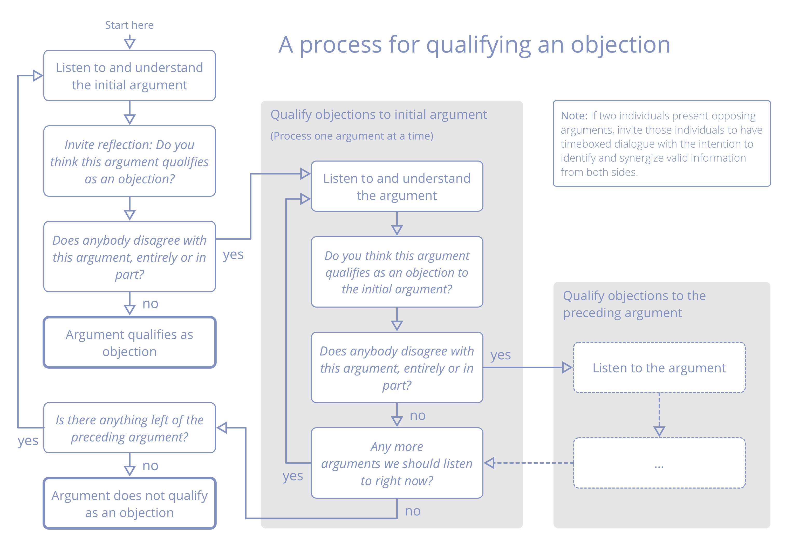

_An **objection** is a reason why doing something stands in the way of (more) effective response to an organizational driver (i.e. an organizational requirement)._

Objections reveal information about **unintended consequences**, or about **viable ways to improve**.

It’s the accountability of individuals to raise potential objections to proposals, decisions, existing <dfn data-info="Agreement: An agreed upon guideline, process or protocol designed to guide the flow of value.">agreements</dfn> or actions.

Withholding objections can harm the ability of individuals, teams or
the whole organization to respond to <dfn data-info="Organizational Driver: A driver is a person’s or a group&apos;s motive for responding to a specific situation. A driver is considered an **organizational driver** if responding to it would help the organization generate value, eliminate waste or avoid harm.">organizational drivers</dfn>.

Being able to raise *potential* objections at any time means decisions only need *to be good enough for now and safe enough to try*.

Those accountable for the action or (proposed) agreement in question, are responsible for *considering arguments and addressing objections.*

When seeking out potential objections, consider:

- why the <dfn data-info="Intended Outcome: The expected result of an agreement, action, project or strategy.">intended outcome</dfn> would not be (fully) achieved: **effectiveness**
- why it would be wasteful to proceed as proposed (or previously agreed): **efficiency**
- the negative consequences something would have elsewhere (in the same <dfn data-info="Domain: A distinct area of influence, activity and decision making within an organization.">domain</dfn>, in the wider organization, or beyond): **side-effects**

The information revealed by objections can be used to improve:

-   current and planned action
-   how people execute on decisions
-   existing agreements
-   proposals
-   shared understanding of drivers

### Qualify Objections

Not all arguments raised are objections. Distinguish between objections, which always reveal useful information, and other arguments that are based only on assumption or preference.

To discover if an argument qualifies as an objection, in a group context a facilitator might ask:

_“Do you think this argument qualifies as an objection?”_

If nobody disagrees with the argument, an objection typically qualifies.  Otherwise aim to discover the actual objection or reveal any misconceptions.

### Understanding Objections

Some helpful questions:

-   How does the argument relate to this specific proposal or agreement?
-   Does the argument reveal how a (proposed or current) **action or agreement**:
    -   harms response to any organizational driver?
    -   can be improved right now?
    -   prevents or diminishes someone's contribution towards responding to a driver?
    -   is in conflict with the organization's values?
    -   is considered not ‘safe enough’ to try?

### Concerns

_A **concern** is an assumption that doing something (even in the absence of objections) **might** stand in the way of (more) effective response to an organizational driver._

In [Consent Decision Making](consent-decision-making.html), concerns can inform ways to further evolve agreements (including evaluation criteria and frequency of evaluation).  

Bring up concerns if you consider them important and at least record them along with evaluation criteria.

If you are in doubt whether you have an objection or a concern, check with others if they think it qualifies as an objection.

[&#9654; Resolve Objections](resolve-objections.html) [&#9664; Consent Decision Making](consent-decision-making.html) [&#9650; Co-Creation And Evolution](co-creation-and-evolution.html)

